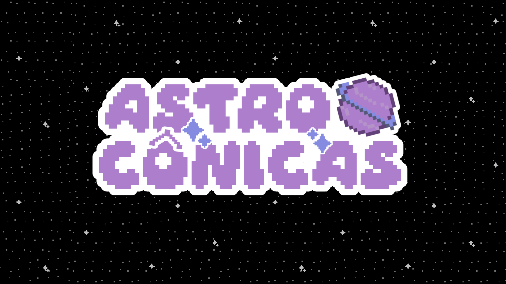

# 🪐 AstroCônicas - Simulador de "Órbitas" Cônicas

 <!-- O banner é pra estar aqui -->

> **Transforme equações gerais de cônicas em jornadas cósmicas visuais**

## ✨ Recursos
- 🎚️ Controle interativo de parâmetros
- 🪐 Visualização 2D de órbitas cônicas
- 📚 Explicações físicas para casos degenerados
- ⚡ Renderização com Manim


## ✏️ Descrição
O programa do Astrocônicas simula órbitas planetárias a partir da equação geral de uma cônica. Na interface, o usuário fornece os coeficientes da equação geral, que será reduzida e animada como uma órbita. O principal foco do programa é mostrar os casos possíveis de órbitas que de fato acontecem na mecânica celeste: órbita elíptica, órbita hiperbólica e órbita parabólica. Entretanto, o programa também reconhece os casos degenerados, informando ao usuário algumas informações em um breve texto. 


## 🔍 Ensaio sobre o método
Quanto ao método utilizado para elaboração e estruturação do projeto, a maneira como o código foi construído reflete a forma como o grupo foi dividido. Dessa forma, as três partes componentes (interação, redução e animação) foram divididas como frentes independentes, num primeiro momento. Posteriormente, emergiram como três arquivos que interagiram entre si sob a seguinte rede de importação: os coeficientes obtidos pela parte interativa é enviada para a redução e identificação da cônica, que, por sua vez, é enviada para a animação. 


## 🖥️ Rodando o programa
Para rodar o programa, deve-se instalar os 3 códigos da pasta 'src' e o arquivo 'requerimentos.txt', e ter o Visual Studio Code. Assim, crie uma pasta e ponha todos códigos e o arquivo 'requerimetos.txt' dentro dela.  Por fim, crie um ambiente virtual dentro dessa pasta e o ative corretamente. Tendo ativado o ambiente virtual, execute o comando citado em "instalação rápida". E assim, rode o código 'interface.py'.

## 🚀 Instalação Rápida
Para uma instalação simples, digite o comando abaixo.
```bash
# Instale as dependências
pip install -r requerimentos.txt
```


